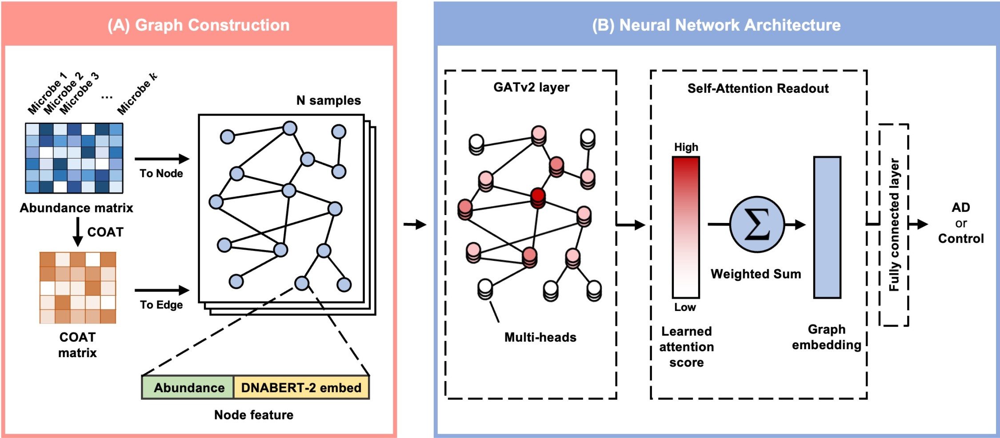

<h1 align="center">ATOMIC: A graph attention neural network for ATOpic dermatitis prediction on human gut MICrobiome</h1>
<p align="center">
	  <a href="https://www.frontiersin.org/journals/immunology/articles/10.3389/fimmu.2025.1670993/abstract"> </a>
  	<a href="https://github.com/KU-MedAI/ATOMIC"></a>
  	<a href="https://www.biorxiv.org/content/10.1101/2025.07.14.664646v1.abstract"></a>
</p>




## Abstract
Atopic dermatitis (AD) is a chronic inflammatory skin disease driven by complex interactions among genetic, environmental, and microbial factors; however, its etiology remains unclear. Recent studies have reported the role of gut microbiota dysbiosis in AD pathogenesis, leading to increased interest in microbiome-targeted therapeutic strategies such as probiotics and fecal microbiota transplantation. Building on these findings, recent advances in computational modeling have introduced machine learning and deep learning-based approaches to capture the nonlinear relationships between gut microbiota and diseases. However, these models focus on diseases other than AD and often fail to capture complex microbial interactions or incorporate microbial genomic information, thereby offering limited interpretability. To address these limitations, we propose ATOMIC, an interpretable graph attention network-based model that incorporates microbial co-expression networks to predict AD. Microbial co-expression networks incorporate microbial genomic information as a node feature, thereby enhancing their ability to capture functionally relevant microbial patterns. To train and test our model, we collected and processed 99 gut microbiome samples from adult patients with AD and healthy controls at Kangwon National University Hospital (KNUH). As a result, ATOMIC achieved an AUROC of 0.810 and an AUPRC of 0.927 for KNUH dataset. Furthermore, ATOMIC identified microbes potentially associated with AD prediction and proposed candidate microbial biomarkers that may inform future therapeutic strategies. To facilitate future research, we publicly released a gut microbial abundance dataset from KNUH.

## Dependencies
Our code is based on the following libraries:

```
torch==2.3.0+cu118
torch-geometric==2.6.1
torch_scatter==2.1.2
scikit-learn==1.5.2
```

## Usage
We follow [COAT (Y Cao et al.)](https://github.com/yuanpeicao/COAT) for compute correlation coefficients.

Prepare microbiome data and Construct graph
```
python preprocessing/extract_genus_abundance.py
python preprocessing/graph_construction.py
```
<code>extract_genus_abundance.py</code> create genus-level abundance data from <code>datasets/abundance</code>.
<code>graph_construction.py</code> create graphs with COAT and DNABERT-2 embedding matrix.
The results are stored in <code>datasets/processed</code>.

Simply run 
```
bash ./scripts/train.sh
```
Run with a fixed epochs
```
bash ./scripts/train_fixed_epoch.sh
```
using both the train set and valid set for training

## Contact
If you have any question regard our study, please contact us (**mjjeon@korea.ac.kr**)

## Funding
This study was supported by the MSIT(Ministry of Science and ICT), Korea, under the Technology development Program(S3364091) of MSS, ICAN (ICT Challenge and Advanced Network of HRD) program (IITP-2025-RS2022-00156439) supervised by the IITP (Institute of Information & Communications Technology Planning & Evaluation) and Bio&Medical Technology Development Program of the National Research Foundation (NRF) funded by the Korean government (MSIT) (No. RS-2024-00441029).

Ack: The readme is inspired by [CIGA](https://github.com/LFhase/CIGA).
